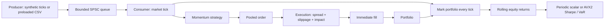

# Low-Latency Event-Driven Backtester

A compact C++20 systems project: one producer sends market ticks through a custom SPSC queue to one consumer, which runs a deterministic strategy, simulates execution, tracks a portfolio, and computes rolling risk. Standard C++ plus x86 AVX2 intrinsics; no library dependencies beyond the platform thread runtime.

The full engine with AVX2 risk measured **31.23 million ticks/sec on Ubuntu/WSL2 with GCC 11.4** and **17.89M on Windows with GCC 16.1**, using the same Intel Core i5-1335U. Windows comparisons measured **11.88M with scalar risk** and **26.35M for queue-only transfer**. Each is a Release-build median of five 100-million-tick runs. Full raw output and machine details are in [BENCHMARKS.md](docs/BENCHMARKS.md). Throughput is workload- and hardware-dependent; this project does not measure per-event or tail latency.



## Build and test

On Linux/x86-64, install a C++20 GCC or Clang compiler and CMake 3.20+:

```sh
cmake -S . -B build -DCMAKE_BUILD_TYPE=Release
cmake --build build -j
ctest --test-dir build --output-on-failure
./build/backtester_tests
```

For Clang, add `-DCMAKE_CXX_COMPILER=clang++` when configuring a fresh build directory. AVX2 is enabled only for its separate source file; runtime detection includes CPU and OS support. `auto` falls back to scalar, while an unavailable explicit `--risk avx2` request fails clearly.

```sh
# Verify the build with AVX2 completely omitted.
cmake -S . -B build-scalar -DCMAKE_BUILD_TYPE=Release -DBT_ENABLE_AVX2=OFF
cmake --build build-scalar -j
ctest --test-dir build-scalar --output-on-failure

# Debug checks; synthetic benchmarking is deliberately disabled here.
cmake -S . -B build-debug -DCMAKE_BUILD_TYPE=Debug
cmake --build build-debug -j
ctest --test-dir build-debug --output-on-failure
```

Windows/MSYS2 UCRT64 with GCC, CMake, and Ninja is also supported: add `-G Ninja`, and run `build/backtester.exe`. For Visual Studio multi-configuration builds, use `cmake --build build --config Release` and `ctest --test-dir build -C Release`; executables are under `build/Release`.

## Run

```sh
# Complete engine: five measured runs, each processing 100 million ticks.
./build/backtester benchmark --ticks 100000000 --runs 5 --risk avx2

# Same 48-byte events and producer, without trading/risk logic.
./build/backtester queue --ticks 100000000 --runs 5

# Scalar comparison and focused risk calculation comparison.
./build/backtester benchmark --ticks 100000000 --runs 5 --risk scalar
./build/backtester risk --ticks 1000000 --warmup 10000 --runs 5 --risk scalar
./build/backtester risk --ticks 1000000 --warmup 10000 --runs 5 --risk avx2

# The small example uses a decision every tick so it exercises fills.
./build/backtester replay --csv data/example.csv --strategy-every 1 --runs 1
./build/backtester --help
```

Defaults: 20 million synthetic ticks, three runs, one million warmup ticks, 16,384 queue slots, one million initial cash, 10-share target position, strategy decisions every 64 ticks, and risk recomputation every 256 ticks. Use an odd number of runs so the middle measured run is the median. `--risk-every`, `--strategy-every`, `--slippage-bps`, and `--impact-bps` expose the important cost/frequency tradeoffs.

## Design and assumptions

**Queue and cache behavior.** `try_push` and `try_pop` perform bounded work without a mutex. The producer publishes a completed slot with a release store; an acquire load lets the consumer safely read it. The consumer releases a slot after reading, and the producer acquires that progress before reuse. Cached remote indices reduce cross-core reads. The two writable control blocks are separately `alignas(64)` to avoid false sharing on the target's 64-byte cache lines. Busy-wait wrappers apply backpressure when full or empty; events are never dropped. They consume CPU and depend on the other thread making progress.

**Allocation.** Queue storage is allocated and touched before timing. Returns use a fixed 1,024-element array; orders use a preconstructed, consumer-owned 16-slot pool. Fills are stack values. Only one order is live at a time, so a stack order would suffice for this execution model; the small pool explicitly demonstrates bounded object reuse. CSV parsing, thread creation, result storage, and printing can allocate outside the hot path. Tests instrument normal and aligned C++ `new` on both active threads and require zero allocations through actual trading and risk updates; they do not intercept arbitrary C-library or OS allocations.

**Strategy and execution.** At a decision tick, price movement since the previous decision targets either +10 or −10 shares; small changes preserve the position. Buys start at the ask and sells at the bid. For order quantity `q` and reference liquidity `L`:

```text
participation = q / L
adverse_fraction = (slippage_bps + impact_bps × participation²) / 10,000
buy_price  = ask × (1 + adverse_fraction)
sell_price = bid × (1 − adverse_fraction)
```

Defaults are 0.5 bps slippage and a 2 bps impact coefficient. Doubling participation quadruples the impact per share. Liquidity is a cost reference, not a fill cap: orders fill immediately and completely or are rejected if the model produces an invalid price or overflowing notional. There are no partial fills. The model does not change future market quotes or represent permanent impact.

**Portfolio and risk.** Cash changes by signed fill notional. Position and weighted average entry price support scale-ins, closing trades, and reversals. Equity is cash plus position marked at `last`; total PnL equals realized plus unrealized PnL, within floating-point tolerance. Positions remain open at the end.

```text
r[t] = (equity[t] − equity[t−1]) / equity[t−1]
mean = average of the latest n returns
variance = sum((r − mean)²) / (n − 1)
Sharpe = mean / sqrt(variance)
VaR95 = max(0, 1.6448536269514722 × sqrt(variance) − mean) × max(equity, 0)
```

Sharpe is per observation, unannualized, and assumes zero risk-free return. VaR is a nonnegative, one-observation normal loss estimate in the portfolio's currency. Fewer than two observations yield zero statistics; zero variance yields zero Sharpe by convention. Nonpositive/nonfinite equity intervals are skipped and rebased, with a reported skip counter. Risk after such gaps describes the last valid observations. Irregular CSV timestamps do not turn these into fixed-time or daily metrics.

The scalar and AVX2 implementations use the same stable two-pass sample variance. AVX2 processes four doubles per vector and uses AVX2 lane permutations in reductions that feed the reported mean and variance. Square root and final Sharpe/VaR formulas are scalar. Tests compare both implementations, including buffer wrap, short/tail lengths, and nearly constant returns. Recomputing every 256 events controls the scan cost; equity and return history still update every event. A final incomplete risk interval is included in timing.

**Replay.** CSV is loaded and validated before threads/timing begin, then replayed as fast as possible without sleeping on timestamps. The exact header is:

```csv
timestamp_ns,instrument,bid,ask,last,liquidity
1000,0,99.99,100.01,100.00,1000
```

Only instrument 0 is supported. Timestamps must be unsigned and nondecreasing; prices/liquidity must be finite and positive; prices are capped at `1e9`, and bid cannot exceed ask. No quoting, extra columns, or padded fields. Replay requires memory proportional to the input file. Configurations that overflow final accounting or risk are rejected with an error.

## Benchmark integrity and testing

Only Release builds accept benchmark modes. `steady_clock` starts after both threads are created and the producer is ready, just before releasing the start gate. It stops after consumption and final risk calculation. Synthetic generation or replay reads, queue transfer/waits, strategy, execution, accounting, and scheduled risk are included. Initialization, CSV parsing, thread join, warmup, and printing are excluded. Each full-engine repetition starts fresh. Final state makes the computation observable; no per-tick logging occurs.

Tests cover full/empty FIFO behavior, ring wrap, one million concurrent transfers without loss or duplication, pool exhaustion/reuse, execution costs, accounting, risk, malformed replay, scalar/AVX2 agreement, and allocation-free event loops. Optional Linux sanitizer checks:

```sh
cmake -S . -B build-asan -DCMAKE_BUILD_TYPE=Debug -DBT_SANITIZE=ON
cmake --build build-asan -j
ctest --test-dir build-asan --output-on-failure
cmake -S . -B build-tsan -DCMAKE_BUILD_TYPE=Debug -DBT_TSAN=ON
cmake --build build-tsan -j
ctest --test-dir build-tsan --output-on-failure
```

Sanitizer runs are correctness checks, never benchmark evidence. See [measured results and verification status](docs/BENCHMARKS.md) for what actually ran here.

On the tested WSL installation, TSan needed a process-local address-layout workaround; see that verification page for the exact command. Keep Linux and Windows builds in different directories when using the same checkout.

## Project map

```text
CMakeLists.txt
include/backtester/
  types.hpp          Tick, Order, Fill
  spsc_queue.hpp     Bounded atomic queue and cache separation
  object_pool.hpp    Fixed consumer-owned order storage
  trading.hpp        Strategy, execution costs, portfolio accounting
  risk.hpp           Rolling return storage and risk API
  engine.hpp         The tick-to-risk pipeline
  data.hpp           Synthetic source and replay API
src/
  main.cpp           CLI, producer/consumer loop, benchmarks
  data.cpp           CSV parsing before replay
  risk.cpp           Scalar statistics and CPU dispatch
  risk_avx2.cpp      Vectorized statistics
tests/               Five focused source files; no test framework
data/example.csv
docs/BENCHMARKS.md    Hardware, methodology, measured evidence
docs/benchmarks/      Raw benchmark and verification output
```

## Limitations to disclose

One instrument, double-precision money, bounded target positions, no fees beyond modeled execution costs, no borrowing/margin constraints, no exchange/order-book/partial-fill model. The strategy observes a tick and fills against that same quote, assuming zero decision/transmission delay and continued quote availability; this is optimistic for real trading. The synthetic feed is a deterministic stress workload, and its PnL is not a profitability claim. Normal VaR understates many heavy-tail scenarios, and rolling per-event risk is not an institutional risk model. No CPU pinning, hard real-time guarantees, or percentile latency measurements are provided.

## Repository contents

This repository includes source code, tests, dependency manifests, setup documentation, and required example data. Downloaded datasets, trained models, caches, generated reports, benchmark logs, and personal interview preparation are excluded. Result paths mentioned above are generated locally by the documented commands; previously reported measurements describe the original local runs.
